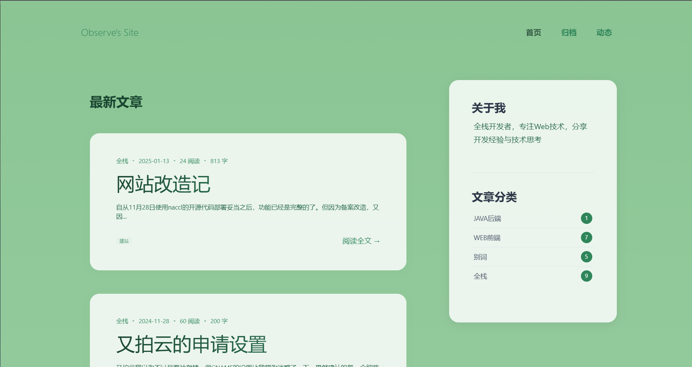
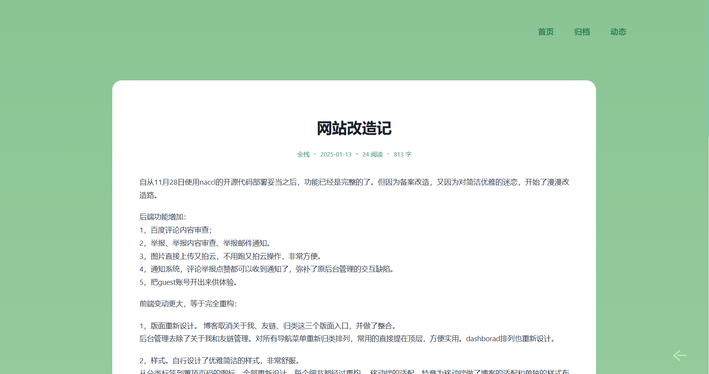
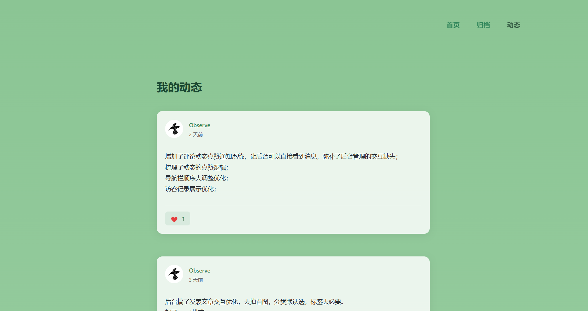
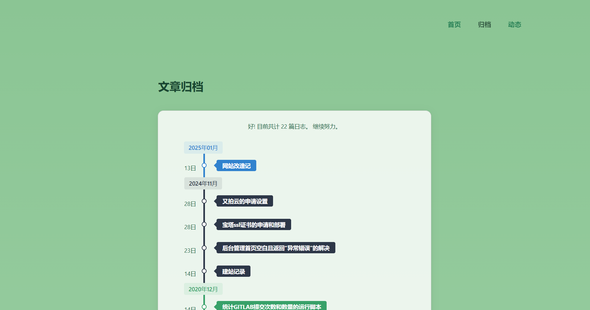
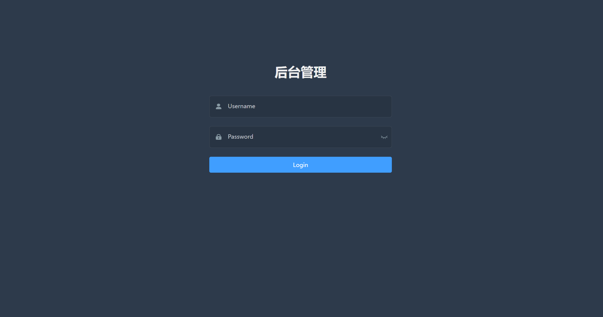
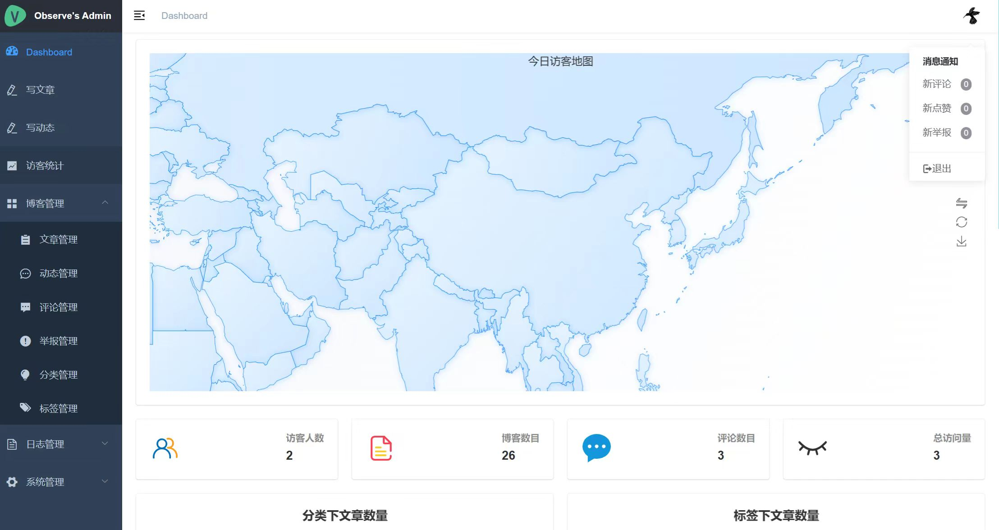
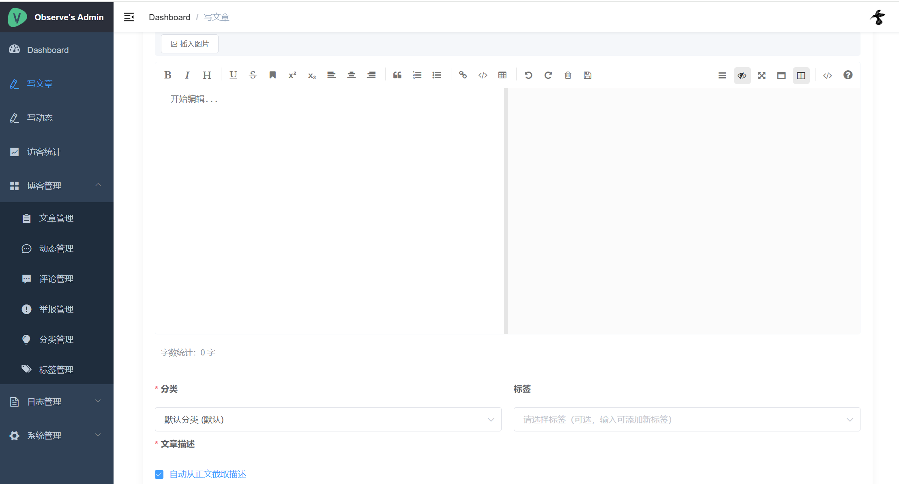
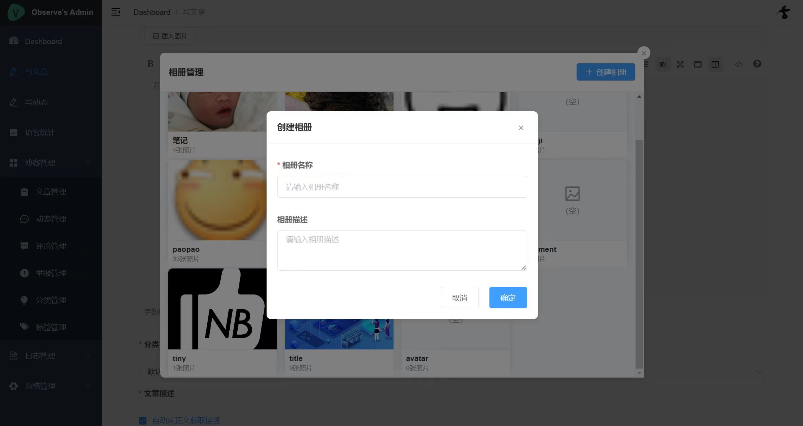

# 蔡小虎博客系统

[](./LICENSE)
[](https://github.com/vuejs/vue)
[](https://github.com/spring-projects/spring-boot)
[](https://www.mysql.com/)
[](https://redis.io/)

> 一个基于Spring Boot + Vue的前后端分离博客系统，注重个人技术分享，支持本地图片存储，内置内容审核。

预览地址：
- 博客前台：[https://caixiaohu.com](https://caixiaohu.com)
- 管理后台：[https://set.caixiaohu.com](https://set.caixiaohu.com)

特色功能：
- 🔒 支持内容审核，自动过滤违规内容
- 📦 支持本地/云存储双模式，不强依赖第三方服务
- 📱 全面适配移动端，交互体验优化
- ⚡️ 文章编辑自动保存，防止意外丢失
- 🖼️ 相册管理系统，支持一键插入文章
- 📨 完善的通知系统，支持站内消息和邮件提醒

## 目录

- [简介](#简介)
- [技术栈](#技术栈)
  - [后端](#后端)
  - [前端](#前端)
- [功能介绍](#功能介绍)
  - [后端新特性](#后端新特性)
  - [前端优化](#前端优化)
- [项目截图](#项目截图)
- [快速开始](#快速开始)
  - [开发环境](#开发环境)
  - [环境配置](#环境配置说明)
- [注意事项](#注意事项)
- [许可证](#license)
- [致谢](#致谢)
- [更新日志](#更新日志)
  - [开发计划](#开发计划)

## 简介

Spring Boot + Vue 博客系统

自用博客，长期维护，欢迎勘误

## 技术栈

### 后端
- 核心框架：Spring Boot 2.2.x
- 安全框架：Spring Security
- 数据库：MySQL 5.7+
- 缓存：Redis 6.0+
- Token：[jjwt](https://github.com/jwtk/jjwt) 0.9.1
- ORM：MyBatis + PageHelper
- 内容审核：基于百度智能云文本审核API
- 对象存储：又拍云SDK / 本地文件系统
- 其他：
  - Markdown渲染：commonmark-java
  - IP地址库：ip2region
  - 定时任务：quartz
  - UA解析：yauaa

### 前端
- 核心框架：Vue 2.6.x + Vue Router + Vuex
- UI组件：Element UI 2.x
- 构建工具：Vue CLI 4.x
- HTTP：axios
- 编辑器：mavonEditor（支持自动保存）
- 可视化：echarts
- 工具库：
  - dayjs（时间处理）
  - lodash（工具函数）
  - v-viewer（图片预览）
  - prismjs（代码高亮）

## 功能介绍

本博客基于 [Naccl/NBlog](https://github.com/Naccl/NBlog) 进行二次开发，更加专注于个人技术心得分享。

### 后端新特性
| 功能 | 描述 |
|------|------|
| 内容审核 | 集成百度内容审核API，自动审查评论内容 |
| 举报系统 | 支持内容举报、举报审查及邮件通知 |
| 云存储集成 | 支持图片直接上传至又拍云，操作便捷 |
| 灵活的图片存储 | 支持本地服务器存储和又拍云存储双模式，可自由切换，不强依赖第三方服务 |
| 通知系统 | 评论、举报、点赞等操作均可触发通知提醒 |
| 访客体验 | 提供guest账号供访客体验后台功能 |

### 前端优化

#### 界面重构
- **版面重新设计**
  - 优化博客入口：整合关于我、友链、归类等功能
  - 重构后台管理：简化导航菜单，优化dashboard布局
  - 统一设计风格：采用优雅简洁的视觉风格
  
- **移动端适配**
  - 专门针对移动端进行布局调整
  - 优化移动端交互体验

#### 交互优化
- **博客前台**
  - 添加返回功能和条件悬浮导航
  - 简化评论信息填写流程
  - 优化表情选择界面
  
- **后台管理**
  - 简化文章发布流程
    - 自动截取文章描述
    - 默认分类处理
    - 标签可选填
    - 智能默认选项
  - 相册管理功能
    - 支持图片库管理
    - 一键插入文章
  - 草稿箱功能
    - 本地保存草稿
    - 不占用服务器资源
  - 访客记录增强
    - 添加设备图标显示
    - 支持查看详细UA信息
  - 系统通知集成
    - 替换原有链接
    - 支持快速跳转管理

## 项目截图

### 博客前台





### 后台管理




> 更多功能等待你的探索...

## 快速开始

### 环境配置说明

#### 环境要求
- JDK: 1.8+
- MySQL: 5.7+（必须使用utf8mb4字符集）
- Redis: 6.0+
- Node.js: 12.x+
- Maven: 3.6+
- Node.js: 12.x+
- NPM: 6.x+

#### 核心配置
- **安全配置**
  - `token.secretKey`: JWT密钥（必须修改默认值）
  - 默认管理员：用户名`Admin`，密码`123456`
  - 密码生成：使用`HashUtils.main()`方法

- **存储配置**
  - 支持本地存储和又拍云存储
  - 本地存储：配置`upload.path`和权限
  - 又拍云：配置`bucketName`等信息

- **第三方服务**
  - 百度内容审核：配置`baidu.content.*`（可选）
  - 邮件服务：默认QQ邮箱，可切换其他服务商

### 开发环境搭建

1. 创建 MySQL 数据库：
```sql
CREATE DATABASE nblog CHARACTER SET utf8mb4 COLLATE utf8mb4_unicode_ci;
```
然后执行`/blog-api/nblog.sql`初始化表数据

2. 创建配置文件`/blog-api/src/main/resources/application-dev.properties`（生产环境需要创建`application-prd.properties`）
3. 复制`/blog-api/src/main/resources/application-dev.properties.template`到`application-dev.properties`
4. 修改替换`application-dev.properties`中的配置信息
5. 安装 Redis 并启动
6. 启动后端服务
7. 分别在`blog-cms`和`blog-view`目录下执行`npm install`安装依赖
8. 分别在`blog-cms`和`blog-view`目录下执行`npm run serve`启动前后台页面

## 注意事项

### 配置及依赖说明
- **依赖版本**
  - Maven 和 NPM 依赖版本固定，请勿随意升级或降级
  - 确保各组件版本：
    - JDK: 1.8+
    - MySQL: 5.7+ (必须使用`utf8mb4`字符集以支持emoji)
    - Redis: 6.0+
    - Node.js: 12.x+

- **第三方服务配置**
  - 百度内容审核：需自行申请API密钥，可选开启
  - 又拍云存储：需自行申请账号和配置空间，可选用本地存储
  - 邮箱服务：默认配置QQ邮箱，可切换其他服务商

- **核心配置说明** (`application-dev.properties`)
  - 安全相关：
    - 必须修改`token.secretKey`

## 许可证

本项目基于MIT许可证开源，详见 [LICENSE](./LICENSE) 文件。

原项目 [Naccl/NBlog](https://github.com/Naccl/NBlog) 同样采用MIT许可证。

## 致谢

- 感谢 [Naccl/NBlog](https://github.com/Naccl/NBlog) 提供的优秀开源项目
- 感谢以下开源项目：
  - [Spring Boot](https://github.com/spring-projects/spring-boot)
  - [Vue](https://github.com/vuejs/vue)
  - [Element UI](https://github.com/ElemeFE/element)
  - 以及 README 中提到的所有开源依赖项目

如果觉得这个项目对你有帮助，欢迎 Star 支持一下 ⭐

## 更新日志

### v1.0.0 (2025-02-13)
- 🎉 首次发布
- ✨ 基于 Naccl/NBlog 重构
- 🔧 优化前端交互体验
- 🎨 重新设计界面风格
- ✅ 支持本地图片存储
- 🔒 集成内容审核功能

### 开发计划
> 未来计划开发的功能和优化

#### 功能增强
- [ ] 编辑器升级
  - [ ] 替换为富文本编辑器
  - [ ] 支持代码块实时高亮
  - [ ] 优化编辑体验
- [ ] 动态模块完善
  - [ ] 支持动态评论功能
  - [ ] 动态点赞和分享
- [ ] 主题定制功能
  - [ ] 支持多套主题模板切换
  - [ ] 自定义主题色调搭配

> 注：开发计划将根据实际需求调整优先级，欢迎提出建议和反馈。
