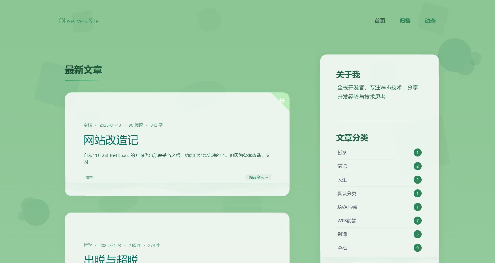
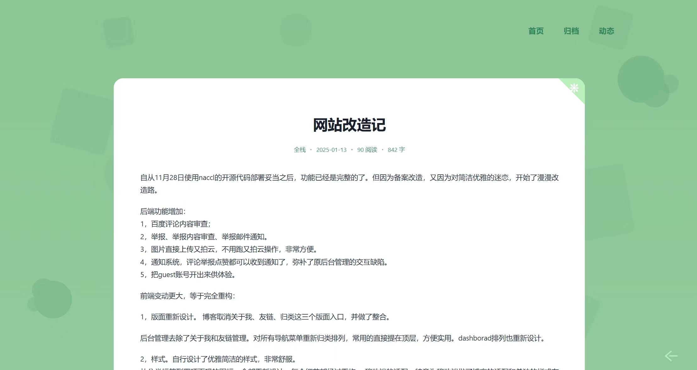
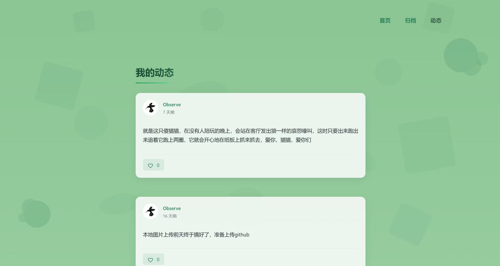
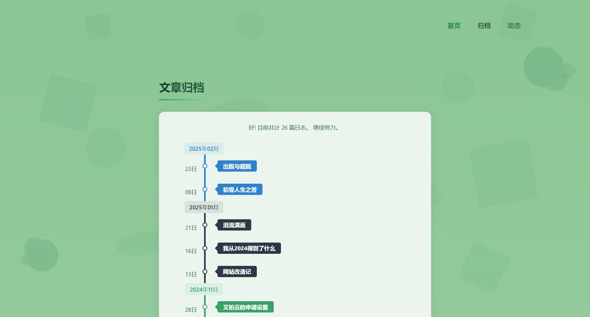

# 蔡小虎博客系统

[](./LICENSE)
[](https://github.com/vuejs/vue)
[](https://github.com/spring-projects/spring-boot)
[](https://www.mysql.com/)
[](https://redis.io/)

> 基于Spring Boot + Vue开发的个人博客系统，支持内容管理、评论互动、数据统计等功能。

预览地址：
- 博客前台：[https://caixiaohu.com](https://caixiaohu.com)
- 管理后台：[https://set.caixiaohu.com](https://set.caixiaohu.com)（访客用户名：guest，密码：123456）

主要功能：
- 内容管理：支持文章、动态等内容管理
- 相册系统：支持图片管理、一键插入、相册分类
- 评论系统：支持评论、回复、点赞、举报功能
- 存储系统：支持本地/云存储
- 消息通知：支持站内消息和邮件通知
- 任务调度：支持定时任务管理
- 数据统计：支持访问统计和用户行为分析

## 目录

- [系统介绍](#系统介绍)
- [技术架构](#技术架构)
- [功能说明](#功能说明)
- [快速开始](#快速开始)
- [注意事项](#注意事项)
- [许可证](#许可证)
- [致谢](#致谢)
- [更新日志](#更新日志)

## 系统介绍

本系统采用前后端分离架构，后端基于Spring Boot开发，前端基于Vue.js开发。系统提供了完整的博客功能，包括内容管理、评论互动、相册管理、数据统计等，并集成了内容审核、消息通知、定时任务等特性。

## 技术架构

### 后端技术
- 核心框架：Spring Boot 2.2.7.RELEASE
- 安全框架：Spring Security
- 数据库：MySQL 5.7+
- 缓存：Redis 6.0+
- Token：jjwt 0.9.1
- ORM：MyBatis + PageHelper
- 内容审核：百度智能云文本审核API
- 对象存储：又拍云SDK / 本地文件系统
- 定时任务：Quartz 2.3.2
- 其他：
  - Markdown渲染：commonmark-java
  - IP地址库：ip2region
  - UA解析：yauaa

### 前端技术
- 核心框架：Vue 2.6.x + Vue Router + Vuex
- UI组件：Element UI 2.x
- 构建工具：Vue CLI 4.x
- HTTP：axios
- 编辑器：mavonEditor
- 可视化：echarts
- 工具库：
  - dayjs（时间处理）
  - lodash（工具函数）
  - v-viewer（图片预览）
  - prismjs（代码高亮）

## 功能说明

### 内容管理
- 文章管理：支持Markdown编辑、自动保存、草稿箱
- 动态管理：支持发布动态、图片上传
- 相册管理：支持图片管理、一键插入
- 内容审核：支持文本内容审核

### 评论互动
- 评论功能：支持评论、回复、点赞
- 评论管理：支持评论审核、举报处理
- 举报功能：支持内容举报、举报处理、结果通知
- 消息通知：支持站内消息、邮件通知

### 系统功能
- 任务调度：支持定时任务配置、执行日志
- 数据统计：支持访问统计、用户行为分析
- 存储管理：支持本地存储、云存储切换

### 用户体验
- 移动端适配：响应式设计，支持各种设备
- 交互优化：触摸操作优化，性能优化
- 界面设计：简洁美观，操作便捷

## 系统截图

### 博客前台
- 博客首页
  - 
- 文章详情
  - 
- 动态
  - 
- 归档
  - 

### 后台管理
- 登录首页
  - 
- 后台管理
  - 
- 撰写界面
  - 
- 相册管理
  - 

## 快速开始

### 环境要求
- JDK: 1.8+
- MySQL: 5.7+（utf8mb4字符集）
- Redis: 6.0+
- Node.js: 12.x+
- Maven: 3.6+
- NPM: 6.x+

### 配置说明

#### 核心配置
- **安全配置**
  - `token.secretKey`: JWT密钥（需修改默认值）
  - 默认管理员：用户名`Admin`，密码`123456`

- **存储配置**
  - 本地存储：配置`upload.path`和权限
  - 又拍云：配置`bucketName`等信息

- **第三方服务**
  - 百度内容审核：配置`baidu.content.*`（可选）
  - 邮件服务：默认QQ邮箱，可切换其他服务商

- **定时任务配置**
  - 使用数据库存储任务配置
  - 表结构已内置在nblog.sql中

### 开发环境搭建

1. 创建 MySQL 数据库：
```sql
CREATE DATABASE nblog CHARACTER SET utf8mb4 COLLATE utf8mb4_unicode_ci;
```
然后执行`/blog-api/nblog.sql`初始化表数据

2. 创建配置文件`/blog-api/src/main/resources/application-dev.properties`（生产环境需要创建`application-prd.properties`）
3. 复制`/blog-api/src/main/resources/application-dev.properties.template`到`application-dev.properties`
4. 修改替换`application-dev.properties`中的配置信息
5. 安装 Redis 并启动
6. 启动后端服务
7. 分别在`blog-cms`和`blog-view`目录下执行`npm install`安装依赖
8. 分别在`blog-cms`和`blog-view`目录下执行`npm run serve`启动前后台页面

## 注意事项

### 配置说明
- **第三方服务配置**
  - 百度内容审核：需自行申请API密钥，可选开启
  - 又拍云存储：需自行申请账号和配置空间，可选用本地存储
  - 邮箱服务：默认配置QQ邮箱，可切换其他服务商

## 许可证

本项目基于MIT许可证开源，详见 [LICENSE](./LICENSE) 文件。

## 致谢

感谢以下开源项目：
- [Spring Boot](https://github.com/spring-projects/spring-boot)
- [Vue](https://github.com/vuejs/vue)
- [Element UI](https://github.com/ElemeFE/element)
- 以及 README 中提到的所有开源依赖项目

## 更新日志

### v2.0.0 (2025-05-21)
- 新增消息中心功能，统一收纳评论点赞举报的历史消息
- 优化定时任务系统（基于Quartz），防止不断重启
- 优化导航路径,更新系统图标,优化用户界面

### v1.0.0 (2025-02-13)
- 优化前端交互体验
- 重新设计界面风格
- 支持本地图片存储
- 增加相册管理模块
- 集成内容审核功能

### 开发计划
- 编辑器升级：替换为富文本编辑器
- 动态模块完善：支持动态评论功能
- 主题定制功能：支持多套主题模板切换
