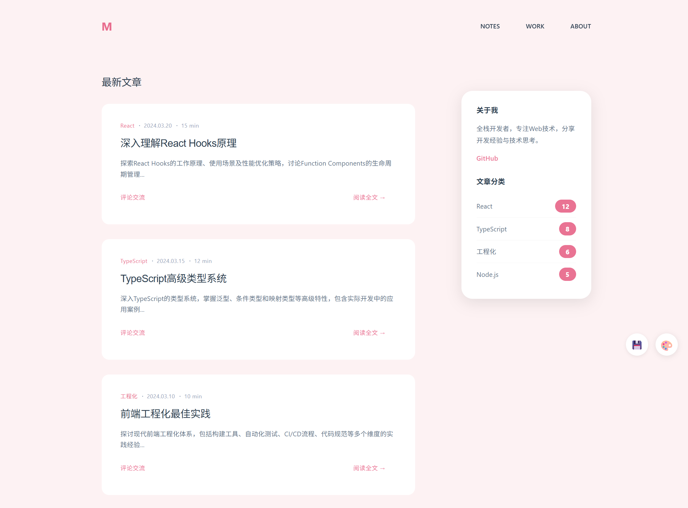
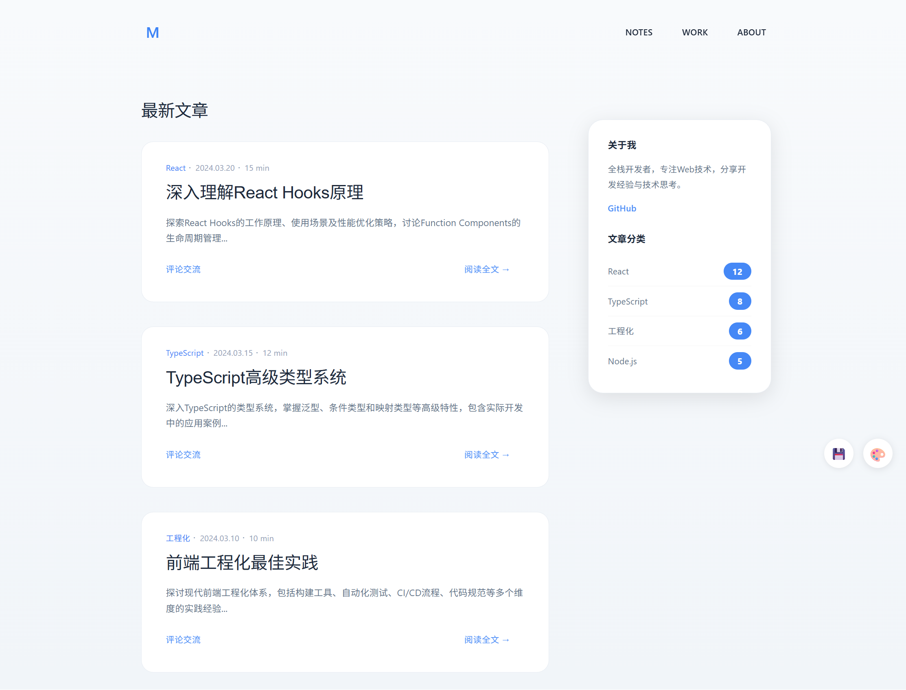
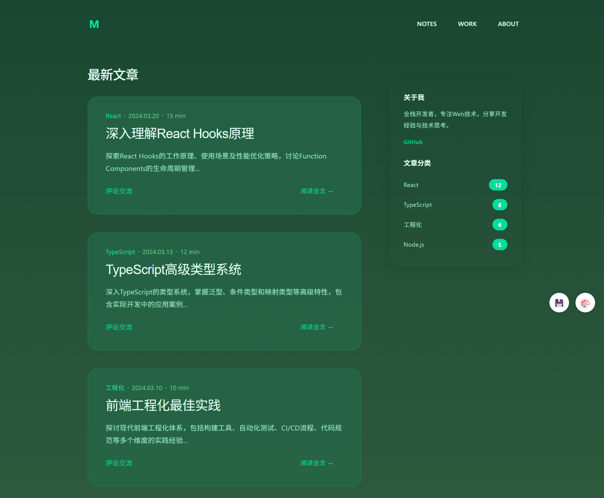
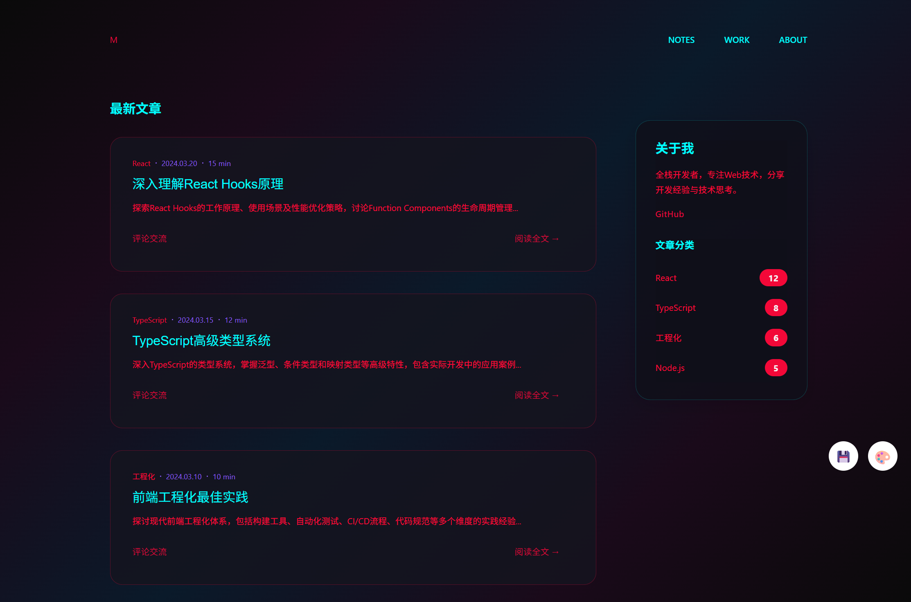
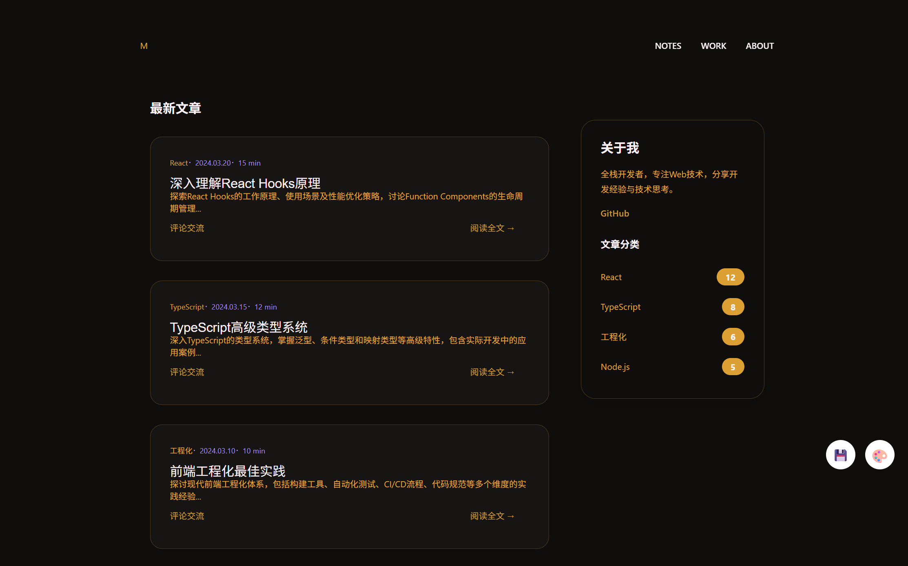
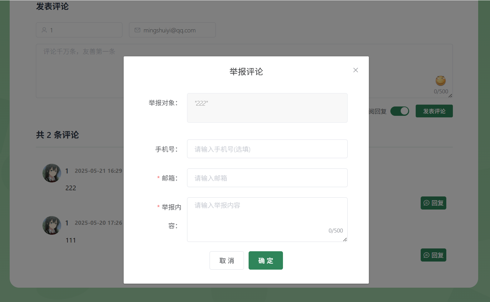

# 蔡小虎博客系统

[English](./README_EN.md) | 简体中文

[](./LICENSE)
[](https://github.com/vuejs/vue)
[](https://github.com/spring-projects/spring-boot)
[](https://www.mysql.com/)
[](https://redis.io/)

基于Spring Boot + Vue开发的个人博客系统，功能完整，配置简单。
包含文章管理、评论系统、相册管理、主题切换等常用功能。

## 主要特点
- 配置要求低，部署简单
- 提供8套主题，可自由切换
- 功能稳定，持续更新
- 适合个人博客使用

## 特色功能

### 1. 主题系统
- 提供8套不同风格的主题
- 后台可一键切换
- 支持主题配置保存

### 2. 相册管理
- 图片管理与一键插入
- 相册分类与批量操作
- 支持本地和又拍云双存储

### 3. 内容安全
- 集成百度智能云文本审核
- 支持内容举报与处理
- 结果通知机制

### 4. 消息通知
- 站内消息提醒
- 邮件通知功能
- 消息统一管理

预览地址：
- 博客前台：[https://caixiaohu.com](https://caixiaohu.com)
- 管理后台：[https://set.caixiaohu.com](https://set.caixiaohu.com)（访客用户名：guest，密码：123456）

## 主题展示

系统提供8套不同风格的主题供选择：

<table>
  <tr>
    <td align="center">
      <strong>雅致主题</strong><br>
      
    </td>
    <td align="center">
      <strong>极简主题</strong><br>
      
    </td>
  </tr>
  <tr>
    <td align="center">
      <strong>自然主题</strong><br>
      
    </td>
    <td align="center">
      <strong>翡翠主题</strong><br>
      
    </td>
  </tr>
  <tr>
    <td align="center">
      <strong>赛博主题</strong><br>
      
    </td>
    <td align="center">
      <strong>二次元主题</strong><br>
      
    </td>
  </tr>
  <tr>
    <td align="center">
      <strong>夜幕主题</strong><br>
      
    </td>
    <td align="center">
      <strong>琥珀主题</strong><br>
      
    </td>
  </tr>
</table>

*后台可一键切换主题，满足不同使用需求*

## 目录

- [主要功能](#主要功能)
- [系统截图](#系统截图)
- [快速开始](#快速开始)
- [注意事项](#注意事项)
- [更新日志](#更新日志)
- [许可证](#许可证)
- [致谢](#致谢)

## 功能列表

**内容管理**
- 文章编辑（Markdown支持）
- 动态发布
- 相册管理
- 内容审核

**评论系统**
- 评论回复
- 点赞功能
- 举报处理
- 消息通知

**系统功能**
- 响应式设计
- 移动端适配
- 主题切换
- 数据统计

## 系统截图

### 前台页面





### 后台管理


## 快速开始

1. 初始化数据库并导入表结构（/blog-api/nblog.sql）
2. 复制并配置 /blog-api/src/main/resources/application-dev.properties
3. 前后端（blog-cms、blog-view）分别安装依赖并启动：
   ```bash
   npm install
   npm run serve
   ```

## 环境要求
- JDK 1.8+
- MySQL 5.7+（utf8mb4字符集）
- Redis 6.0+
- Node.js 12.x+
- Maven 3.6+

## 配置说明

**基础配置**
- JWT密钥：修改`token.secretKey`配置项
- 默认管理员：用户名`Admin`，密码`123456`

**存储配置**
- 本地存储：配置`upload.path`路径
- 云存储：配置又拍云相关信息

**可选配置**
- 内容审核：配置百度智能云API（可选）
- 邮件服务：默认QQ邮箱，可修改为其他邮箱
- 定时任务：配置信息存储在数据库中

## 部署步骤

### 1. 数据库初始化
创建MySQL数据库：
```sql
CREATE DATABASE nblog CHARACTER SET utf8mb4 COLLATE utf8mb4_unicode_ci;
```
导入数据表：
```bash
mysql -u root -p nblog < /blog-api/nblog.sql
```

### 2. 后端配置
创建配置文件`/blog-api/src/main/resources/application-dev.properties`（生产环境需要创建`application-prd.properties`）

复制配置文件模板：
```bash
cp /blog-api/src/main/resources/application-dev.properties.template application-dev.properties
```
修改替换`application-dev.properties`中的配置信息

### 3. 启动服务
安装Redis并启动，然后启动后端服务

### 4. 前端部署
分别在`blog-cms`和`blog-view`目录下执行`npm install`安装依赖：
```bash
cd blog-cms && npm install
cd blog-view && npm install
```

分别在`blog-cms`和`blog-view`目录下执行`npm run serve`启动前后台页面：
```bash
# 管理后台
cd blog-cms && npm run serve

# 博客前台  
cd blog-view && npm run serve
```

生产环境构建：
```bash
# 构建管理后台
cd blog-cms && npm run build

# 构建博客前台
cd blog-view && npm run build
```

## 更新日志

### v2.1.0 (2025-09-20)
- 在原有4套主题基础上新增4套主题（赛博、二次元、夜幕、琥珀）
- 继续完善主题系统和切换功能

### v2.0.0 (2025-06-09)
- 新增主题保存与切换功能，支持多套主题模板一键切换并保存，提升个性化体验，美化你的网站。入口：后台管理-系统管理-主题设置

### v1.1.0 (2025-05-21)
- 新增消息中心功能
- 优化定时任务系统
- 改进用户界面

### v1.0.0 (2025-02-13)
- 完善前端交互功能
- 重新设计界面
- 支持本地图片存储
- 增加相册管理
- 集成内容审核

### 开发计划
- 主题个性化功能增强
- 编辑器功能升级  
- 动态评论功能完善

## 许可证

本项目基于MIT许可证开源，详见 [LICENSE](./LICENSE) 文件。

## 致谢

感谢以下开源项目：
- [Spring Boot](https://github.com/spring-projects/spring-boot)
- [Vue](https://github.com/vuejs/vue)  
- [Element UI](https://github.com/ElemeFE/element)

---
[](https://github.com/cdacai/blog)

如有问题欢迎提交issue，感谢支持！
