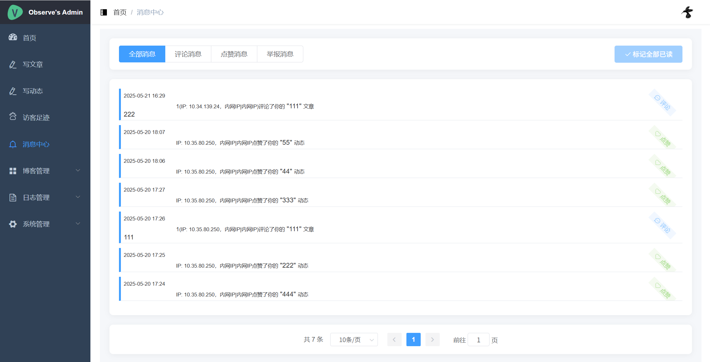

# Cai Xiaohu Blog System

[简体中文](./README.md) | English

[](./LICENSE)
[](https://github.com/vuejs/vue)
[](https://github.com/spring-projects/spring-boot)
[](https://www.mysql.com/)
[](https://redis.io/)

A personal blog system built with Spring Boot + Vue, featuring complete functionality and simple configuration.
Includes article management, comment system, album management, theme switching and other common features.

## Key Features
- Low configuration requirements, easy deployment
- Provides 8 different theme styles, freely switchable
- Stable functionality, continuously updated
- Suitable for personal blog use

## Featured Functions

### 1. Theme System
- Provides 8 different style themes
- One-click switching in admin panel
- Support for theme configuration saving

### 2. Album Management
- Image management and one-click insertion
- Album categorization and batch operations
- Support for both local and Upyun cloud storage

### 3. Content Security
- Integration with Baidu AI text review
- Support for content reporting and processing
- Result notification mechanism

### 4. Message Notifications
- Internal message reminders
- Email notification functionality
- Unified message management

Preview URLs:
- Blog Frontend: [https://caixiaohu.com](https://caixiaohu.com)
- Admin Backend: [https://set.caixiaohu.com](https://set.caixiaohu.com) (Guest username: guest, password: 123456)

## Theme Gallery

System provides 8 different style themes for selection:

<table>
  <tr>
    <td align="center">
      <strong>Elegant Theme</strong><br>
      
    </td>
    <td align="center">
      <strong>Minimal Theme</strong><br>
      
    </td>
  </tr>
  <tr>
    <td align="center">
      <strong>Natural Theme</strong><br>
      
    </td>
    <td align="center">
      <strong>Jade Theme</strong><br>
      
    </td>
  </tr>
  <tr>
    <td align="center">
      <strong>Cyber Theme</strong><br>
      
    </td>
    <td align="center">
      <strong>Anime Theme</strong><br>
      
    </td>
  </tr>
  <tr>
    <td align="center">
      <strong>Nightfall Theme</strong><br>
      
    </td>
    <td align="center">
      <strong>Amber Theme</strong><br>
      
    </td>
  </tr>
</table>

*One-click theme switching in admin panel to meet different usage needs*

## Table of Contents

- [Function List](#function-list)
- [System Screenshots](#system-screenshots)
- [Quick Start](#quick-start)
- [Changelog](#changelog)
- [License](#license)
- [Acknowledgments](#acknowledgments)

## Function List

**Content Management**
- Article editing (Markdown support)
- Dynamic publishing
- Album management
- Content review

**Comment System**
- Comment replies
- Like functionality
- Report processing
- Message notifications

**System Functions**
- Responsive design
- Mobile adaptation
- Theme switching
- Data statistics

## System Screenshots

### Frontend Pages




### Admin Management


## Quick Start

1. Initialize the database and import table structure (/blog-api/nblog.sql)
2. Copy and configure /blog-api/src/main/resources/application-dev.properties
3. Install dependencies and start both frontend (blog-cms) and blog-view:
   ```bash
   npm install
   npm run serve
   ```

## Environment Requirements
- JDK 1.8+
- MySQL 5.7+ (utf8mb4 charset)
- Redis 6.0+
- Node.js 12.x+
- Maven 3.6+

## Configuration Guide

**Basic Configuration**
- JWT key: modify `token.secretKey` configuration
- Default admin: username `Admin`, password `123456`

**Storage Configuration**
- Local storage: configure `upload.path` directory
- Cloud storage: configure Upyun cloud related information

**Optional Configuration**
- Content review: configure Baidu AI API (optional)
- Email service: default QQ email, can be changed to other providers
- Scheduled tasks: configuration stored in database

## Deployment Steps

### 1. Database Initialization
Create MySQL database:
```sql
CREATE DATABASE nblog CHARACTER SET utf8mb4 COLLATE utf8mb4_unicode_ci;
```
Import data tables:
```bash
mysql -u root -p nblog < /blog-api/nblog.sql
```

### 2. Backend Configuration
Create configuration file `/blog-api/src/main/resources/application-dev.properties` (for production environment, create `application-prd.properties`)

Copy configuration template:
```bash
cp /blog-api/src/main/resources/application-dev.properties.template application-dev.properties
```
Modify and replace configuration information in `application-dev.properties`

### 3. Start Services
Install and start Redis, then start backend API service

### 4. Frontend Deployment
Install dependencies in `blog-cms` and `blog-view` directories respectively:
```bash
cd blog-cms && npm install
cd blog-view && npm install
```

Start development services in `blog-cms` and `blog-view` directories respectively:
```bash
# Admin backend
cd blog-cms && npm run serve

# Blog frontend  
cd blog-view && npm run serve
```

Production build:
```bash
# Build admin backend
cd blog-cms && npm run build

# Build blog frontend
cd blog-view && npm run build
```

## Changelog

### v2.1.0 (2025-09-20)
- Added 4 new themes (Cyber, Anime, Nightfall, Amber) based on the original 4 themes
- Continued to improve theme system and switching functionality

### v2.0.0 (2025-06-09)
- Added theme saving and switching functionality, supporting multiple theme templates with one-click switching and saving, enhancing personalization experience. Entry: Admin Panel - System Management - Theme Settings

### v1.1.0 (2025-05-21)
- Added message center functionality
- Optimized scheduled task system
- Improved user interface

### v1.0.0 (2025-02-13)
- Improved frontend interaction functionality
- Redesigned interface
- Support for local image storage
- Added album management
- Integrated content review

### Development Plan
- Enhanced theme personalization features
- Editor functionality upgrades  
- Dynamic comment functionality improvements

## License

This project is licensed under the MIT License - see the [LICENSE](./LICENSE) file for details.

## Acknowledgments

Thanks to the following open source projects:
- [Spring Boot](https://github.com/spring-projects/spring-boot)
- [Vue](https://github.com/vuejs/vue)  
- [Element UI](https://github.com/ElemeFE/element)

---
[](https://github.com/cdacai/blog)

If you have any questions, please submit an issue. Thank you for your support! 