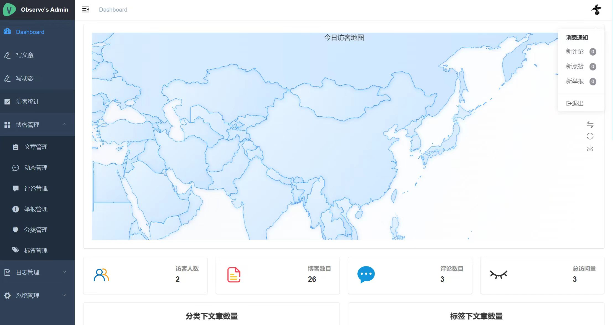
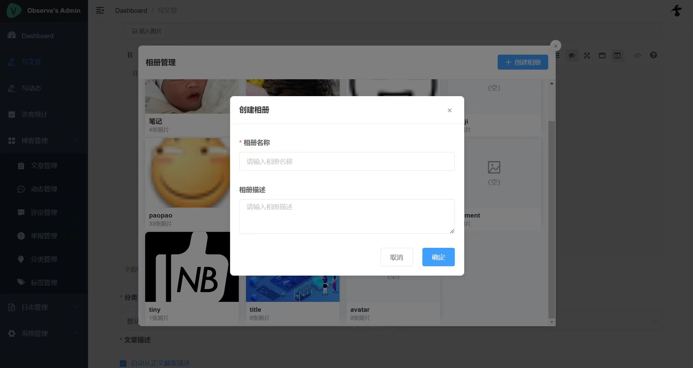

# Cai Xiaohu Blog System

[简体中文](./README.md) | English

[](./LICENSE)
[](https://github.com/vuejs/vue)
[](https://github.com/spring-projects/spring-boot)
[](https://www.mysql.com/)
[](https://redis.io/)

A modern blog system based on Spring Boot and Vue, ideal for individuals and teams to quickly build a beautiful and customizable content platform.
Supports theme switching, article and comment management, album display, data statistics, content moderation, message notifications, scheduled tasks, and more—helping you efficiently operate and beautify your personal blog.

## Why Choose Cai Xiaohu Blog System?
- Ultra-lightweight, low hardware requirements, suitable for most environments
- Four built-in beautiful preset themes, one-click switch in admin panel, highly customizable
- Actively maintained, features continuously upgraded
- Comprehensive content and interaction experience

## Featured Features

### 1. Theme Switching & Personalization
- Four built-in beautiful preset themes, one-click switch in admin panel, real-time preview
- Support for theme saving; upcoming: theme color customization, background pattern toggles, and more personalized options
- Easily beautify your own blog

### 2. Message Center
- Unified collection of comment, like, and report history
- Support for internal messages and email notifications
- Message categorization and status management

### 3. Album Management
- Image management and one-click insertion
- Album categorization and batch operations
- Support for both local and Upyun storage

### 4. Content Security
- Integration with Baidu Cloud Text Review
- Support for content reporting and processing
- Result notification mechanism

### 5. Storage Solutions
- Flexible switching between local file system and Upyun object storage
- Configurable storage strategies

## Screenshots
- Theme Switching
  - 
- Blog Home
  - 
- Article Detail
  - 
- Dynamics
  - 
- Archive
  - 
- Comment Report
  - 
- Message Center
  - 
- Admin Dashboard
  - 
- Editor Interface
  - 
- Album Management
  - 

## Quick Start

1. Initialize the database and import table structure (/blog-api/nblog.sql)
2. Copy and configure /blog-api/src/main/resources/application-dev.properties
3. Install dependencies and start both frontend (blog-cms) and frontend (blog-view):
   ```bash
   npm install
   npm run serve
   ```

## Environment Requirements
- **Basic Environment**
  - JDK: 1.8+ (low requirements, suitable for most computers and servers)
  - MySQL: 5.7+ (utf8mb4 charset)
  - Redis: 6.0+
  - Node.js: 12.x+
  - Maven: 3.6+
  - NPM: 6.x+

## Core Configuration
- **Security Configuration**
  - `token.secretKey`: JWT key (modify default value)
  - Default admin: username `Admin`, password `123456`

- **Storage Configuration**
  - Local storage: configure `upload.path` and permissions
  - Upyun: configure `bucketName` and other information

- **Third-party Services**
  - Baidu Content Moderation: configure `baidu.content.*` (optional)
  - Email service: default QQ email, can switch to other providers

- **Scheduled Task Configuration**
  - Use database for task configuration
  - Table structure included in nblog.sql

## Development Environment Setup
1. Create MySQL database:
```sql
CREATE DATABASE nblog CHARACTER SET utf8mb4 COLLATE utf8mb4_unicode_ci;
```
Then execute `/blog-api/nblog.sql` to initialize table data

2. Create configuration file `/blog-api/src/main/resources/application-dev.properties` (for production, create `application-prd.properties`)
3. Copy `/blog-api/src/main/resources/application-dev.properties.template` to `application-dev.properties`
4. Modify and replace configuration information in `application-dev.properties`
5. Install and start Redis
6. Start backend service
7. Run `npm install` in both `blog-cms` and `blog-view` directories to install dependencies
8. Run `npm run serve` in both `blog-cms` and `blog-view` directories to start frontend and admin pages

## Changelog

### v2.0.0 (2025-06-09)
- Added theme saving and switching feature: support for one-click switching and saving of multiple preset themes (4 built-in), improving personalization experience and beautifying your website. Entry: Admin Panel - System Management - Theme Settings

### v1.1.0 (2025-05-21)
- Added message center, unified collection of comment/like/report history
- Optimized task scheduling system (based on Quartz), preventing constant restarts
- Optimized navigation paths, updated system icons, improved user interface

## License

This project is licensed under the MIT License - see the [LICENSE](./LICENSE) file for details.

## Acknowledgments

Thanks to the following open source projects:
- [Spring Boot](https://github.com/spring-projects/spring-boot)
- [Vue](https://github.com/vuejs/vue)
- [Element UI](https://github.com/ElemeFE/element)
- And all other open source dependencies mentioned in this README
- Your star and suggestions are our continuous motivation!

---
If you like this project, please give it a star! Your support is our motivation to keep improving! [](https://github.com/cdacai/blog)

Feedback and contributions are welcome! 